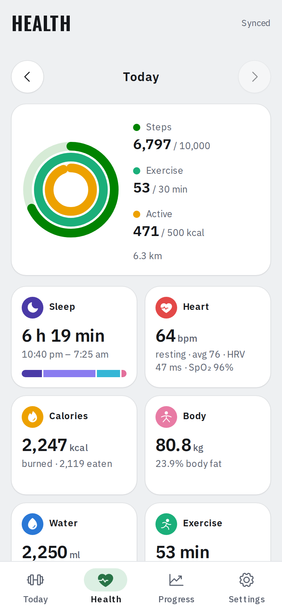
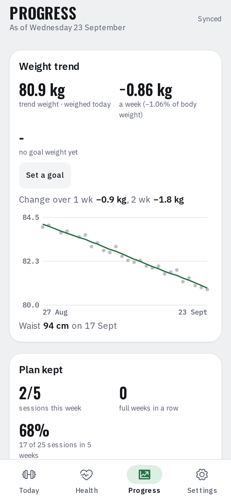
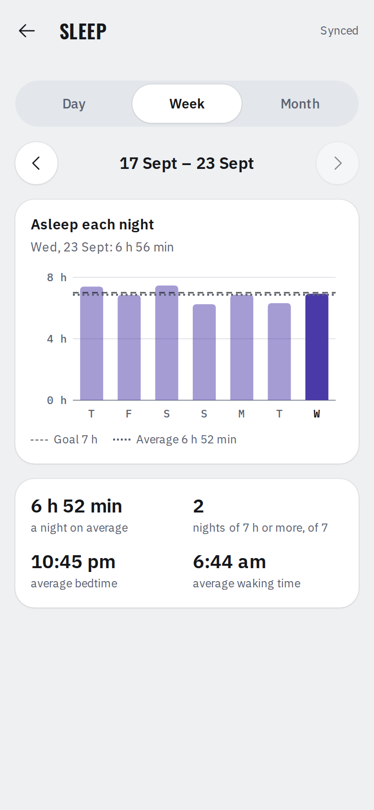
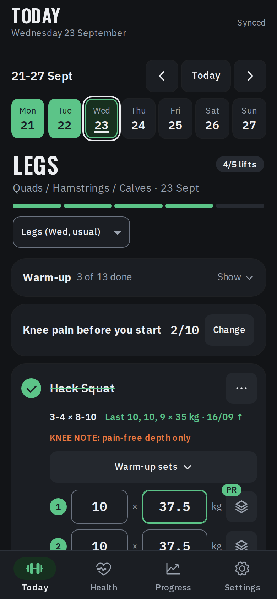
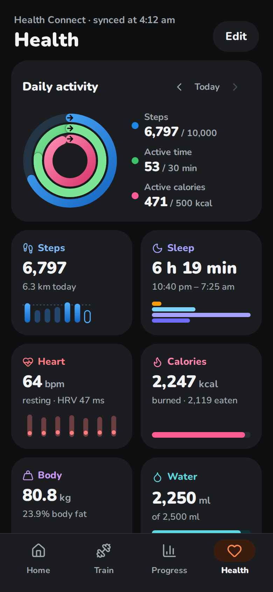
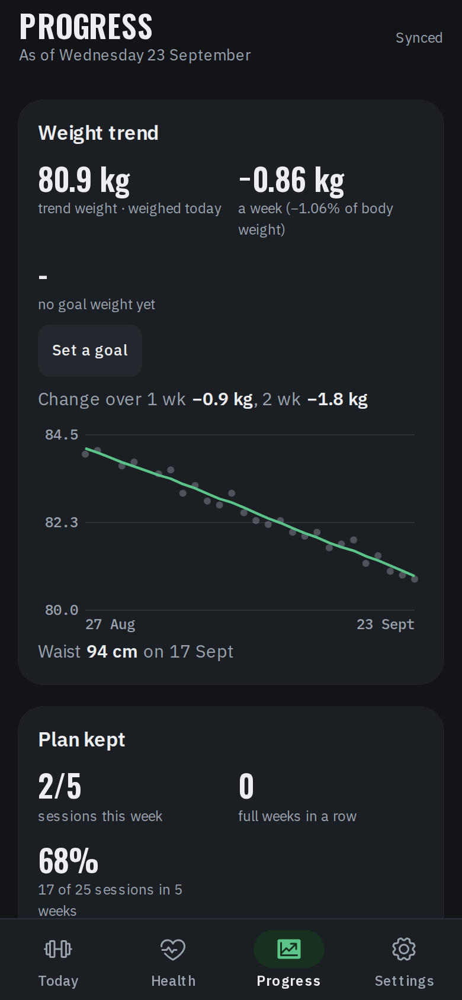
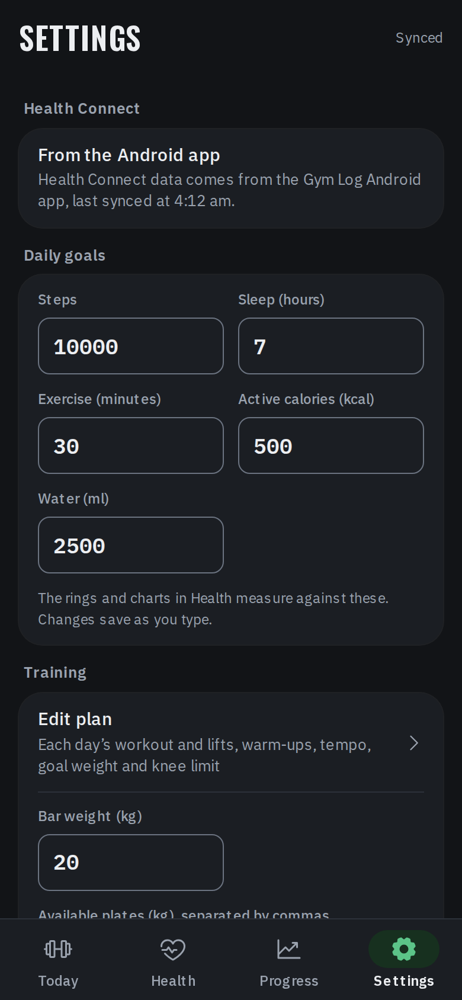
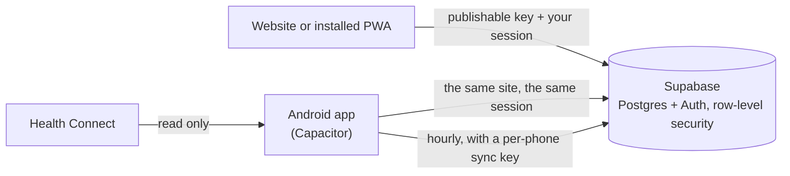

<div align="center">


# Gym Log

**A fast, offline-first workout log for your phone.**

Every set you lift, your body's numbers, and what Health Connect knows, in one place, in your own database.

[](https://github.com/raja2102598/gymlog/actions/workflows/site.yml)
[](https://github.com/raja2102598/gymlog/actions/workflows/android.yml)
[](LICENSE)


[Features](#features) · [Screenshots](#screenshots) · [Install](#install-on-your-phone) · [Run it locally](#run-it-locally) · [Deploy your own](#deploy-your-own) · [Docs](#documentation) · [Contributing](#contributing)

</div>

## Screenshots

<p align="center">
  
  
  
  
</p>
<p align="center">
  
  
  
  
</p>
<p align="center"><sub>Taken from the app itself with made-up data (<code>npm run screenshots</code>). Light or dark follows the phone, or pick one in Settings.</sub></p>

## Features

**Today: the workout, set by set**
- The day's session from your plan, one card per lift: the target (3 × 8-10), what you did last time, and a row per set for reps and kg. The next set copies the weight you just used.
- Log a set by voice: tap a lift's microphone and say *10 at 45*, or *again*, *undo*, *done* or *skip*. Once switched on in Settings: in the browser, or in the Android app with the phone's own speech recognition.
- Progression built in. When every set reached the top of its rep range last time, the lift says *Go up to … kg*, and a set that beats your history gets a **PR** badge as you type it.
- Skip a lift or swap in another, give a day a different session, and catch up on missed sessions on rest days.
- Knee pain scores before, after and the next morning. After a bad session, knee-sensitive lifts hold their weight instead of going up.
- Warm-ups, a cardio finisher (minutes, speed, incline), steps, body weight, waist, other measurements (chest, arms, thighs, hips, body fat) and notes.

**Health: what your phone knows, with the Android app**
- Reads 20 kinds of data from [Health Connect](https://support.google.com/android/answer/12201227): steps by the hour, sleep with its stages, heart rate, HRV, SpO₂, calories burned and eaten, water, weight, body fat, workouts and more. It never writes.
- Activity rings against your daily goals, a tile for each kind of data, and a page for each with the day in detail or a week or month as a chart.
- Hourly background sync, even with the app closed, through a per-phone key that can do one thing only: save that account's recent days.

**Progress: is it working?**
- Weight trend (Holt smoothing, as [TrendWeight](https://github.com/ervwalter/trendweight) does) and the weekly rate, with a goal date and your pace against the target.
- Sessions kept and full weeks in a row, steps by week, estimated 1RM for every lift with a sparkline, lifts ready for more weight, recent records, and knee scores by session, with notes on anything that needs attention.
- Tap a lift, in Strength or on Today's **···** menu, for its own page: heaviest set, estimated 1RM, volume and sessions a week, charted over time.

**Everywhere**
- **Try it with sample data** on the sign-in screen: no account or database needed, four weeks of made-up history to look around, and nothing you do is saved.
- Installable as a PWA from Chrome, or as an Android app. It opens instantly from the phone's cache and works offline; edits queue and sync when you're back online.
- Your data in your own free Supabase project, one account per person, kept apart by row-level security in the database.
- Sign in with Google, an email link or a password. Light and dark themes. Export and import as JSON.
- An editable plan: sessions, lifts, sets and reps, cues, warm-ups, a weight step per lift, goals and the knee limit. Start from a blank week or a 3, 4 or 5-day template.
- An exercise library of 657 lifts with the muscles each works and the equipment it needs: search it, filter it and add lifts to the plan, a swap or a free-form workout, or create your own.

## How it works

The site is a static export of a Next.js app: everything runs in the browser and talks straight to Supabase with the *publishable* key and your session. Row-level security in Postgres means an account can only ever read or write its own rows, so there's no server of your own to run or secure. The Android app is the same site in a Capacitor shell, plus Kotlin that reads Health Connect and syncs it in the background.



Built with Next.js 16 (App Router, static export), React 19 and TypeScript; Supabase (Postgres, Auth, RLS); Capacitor 8 and Kotlin for Android; Vitest and Playwright for the tests.

## Install on your phone

**Web app, any phone:** open the site in Chrome, sign in, then **⋮ → Add to Home screen → Install**. It opens like a normal app and works offline.

**Android app, adds Health Connect:** download `gym-log.apk` from the latest release on the repo's **Releases** page, open it and allow the install. Then **Settings → Health Connect → Connect**. [Android app and Health Connect](docs/android.md) has the details: signing in, background sync, updates and what happens to the data.

## Run it locally

Needs Node.js 20 (20.19 or later), 22 (22.12 or later) or 24, and a Supabase project (the free plan is enough; step 1 of [Deploy your own](#deploy-your-own) sets one up).

```bash
git clone https://github.com/raja2102598/gymlog.git && cd gymlog
npm install
cp .env.example .env.local   # fill in your Supabase project URL and publishable key
npm run dev                  # http://localhost:3000
```

Sign-in links only come back to addresses listed in Supabase under Authentication → URL Configuration, so add `http://localhost:3000/**` there.

| Command | What it does |
|---|---|
| `npm run dev` | The app at localhost:3000, reloading as you edit |
| `npm run build` | The static site in `out/`, plus its service worker |
| `npm run preview` | Serves `out/` at 127.0.0.1:3000 |
| `npm run lint`, `npm run typecheck`, `npm test` | ESLint, TypeScript, and the unit tests (Vitest) |
| `npm run test:e2e` | 300+ browser checks against `out/` in Chromium, with Supabase mocked. Needs Chromium once: `npx playwright-core install chromium` |
| `npm run android` | Builds the site and copies it into `android/`, for Android Studio or Gradle ([building the app](docs/android.md#building-it-yourself)) |
| `npm run screenshots` | Regenerates `docs/screenshots/` from `out/` |

The build and the browser tests read `.env.local` too, so one file covers everything.

## Deploy your own

[](https://vercel.com/new/clone?repository-url=https%3A%2F%2Fgithub.com%2Fraja2102598%2Fgymlog&project-name=gym-log&repository-name=gym-log&env=NEXT_PUBLIC_SUPABASE_URL,NEXT_PUBLIC_SUPABASE_PUBLISHABLE_KEY&envDescription=Your%20Supabase%20project%27s%20URL%20and%20publishable%20key%20%28Project%20Settings%20%E2%86%92%20API%29.%20Run%20supabase%2Fschema.sql%20in%20its%20SQL%20Editor%20first.&envLink=https%3A%2F%2Fgithub.com%2Fraja2102598%2Fgymlog%2Fblob%2Fmain%2F.env.example)

The button copies the repo into your GitHub account, deploys it on Vercel and asks for the two Supabase values. Run `supabase/schema.sql` in your project first (step 1 below), and add the site's address and the Google client ID afterwards (steps 2 and 5). Or by hand:

Nothing about a deployment lives in the source. A build reads four `NEXT_PUBLIC_*` variables, listed in `.env.example`, and all four are public values: they end up in the site's JavaScript anyway.

1. **Supabase:** create a project and run `supabase/schema.sql` in the SQL Editor. It creates the tables (`logs`, `plans`, `health_days`, `health_sync_keys`), their row-level security and the two functions background sync uses, and is safe to re-run. The project URL and publishable key are under Project Settings → API.
2. **Vercel:** Add New → Project → import your fork; `vercel.json` sets the build. Under Settings → Environment Variables add `NEXT_PUBLIC_SUPABASE_URL` and `NEXT_PUBLIC_SUPABASE_PUBLISHABLE_KEY`, and `NEXT_PUBLIC_SITE_URL` (the site's address) once you know it, then deploy again. Every push to `main` deploys.
3. **Sign-in links:** in Supabase → Authentication → URL Configuration, set the Site URL to the site's address and add the address followed by `/**` as a redirect URL.
   **Privacy page:** `public/privacypolicy.html` is what Health Connect and Google's consent screen show. It describes the app; add who runs your copy, where its database is hosted and how to reach you.
4. **Android build, optional:** add the same variables as repository variables on GitHub (Settings → Secrets and variables → Actions → Variables) and the signing key as the two secrets in [docs/android.md](docs/android.md#updates-and-the-signing-key). Every push to `main` then publishes an APK as the `android-latest` release.
5. **Google sign-in, optional:** [docs/google-sign-in.md](docs/google-sign-in.md).

The site is plain static files, so it can be hosted anywhere; Vercel is just what `vercel.json` is written for.

## Project structure

```
src/
  app/             The page, its <head> and the fonts
  components/      One folder per screen: today/, health/, dashboard/ (Progress), settings/, plan/, shell/, ui/
  lib/             store.ts (the data, offline queue and sync), health.ts, stats.ts, dashboard.ts, route.ts, config.ts
  native/          Only runs in the Android app: Health Connect, background sync, Google sign-in
  data/            plan.json (the default plan), templates/ and exercises.json (the exercise library)
  styles/          Design tokens, then one file per screen
android/           The Capacitor project, with Kotlin for Health Connect, background sync and Google sign-in
supabase/          schema.sql: tables, row-level security and functions
tests/             unit/ (Vitest) and e2e/ (Playwright, Supabase mocked); fixtures shared with the Kotlin tests
scripts/           The service-worker generator, a static server, the screenshot script, the exercise library's builder
.github/           CI: site.yml (lint, types, tests, build, browser tests) and android.yml (APK build and release)
```

## Documentation

- [User guide](docs/user-guide.md): every screen, and how the numbers are worked out
- [Android app and Health Connect](docs/android.md): install, background sync, what happens to the data, building and signing
- [Continue with Google](docs/google-sign-in.md): the Google Cloud and Supabase set-up
- [Exercise library](docs/exercise-library.md): where its lifts come from, their licence, and how to update them
- [Roadmap](docs/roadmap.md): what's planned, in order, and what needs new pieces
- [Contributing](CONTRIBUTING.md) and [Security](SECURITY.md)

## Contributing

Issues and pull requests are welcome. [CONTRIBUTING.md](CONTRIBUTING.md) has the set-up, what CI runs and the conventions. For a security problem, see [SECURITY.md](SECURITY.md).

## License

[MIT](LICENSE). The fonts, Oswald and IBM Plex, are under the SIL Open Font License, with their licences in `src/fonts/`; the icons are [Phosphor](https://phosphoricons.com) (MIT). The exercise library comes from [free-exercise-db](https://github.com/yuhonas/free-exercise-db), itself from [exercises.json](https://github.com/wrkout/exercises.json), both public domain under the Unlicense; see [docs/exercise-library.md](docs/exercise-library.md).
