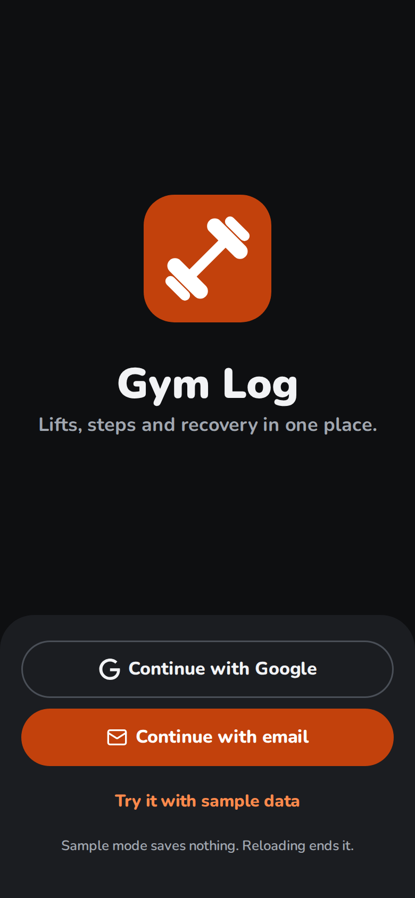
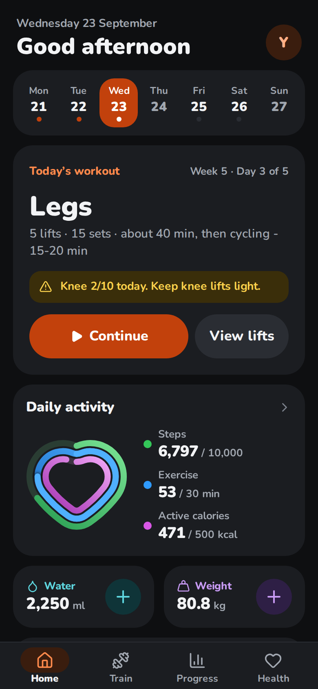
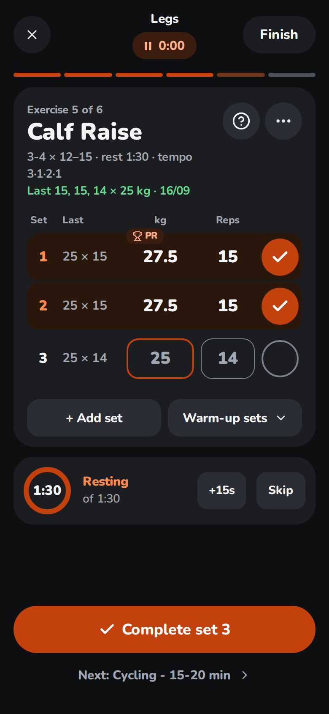

# User guide

Gym Log opens on **Home** and works like a phone app: four tabs along the bottom, **Home**, **Train**, **Progress** and **Health**, and **Settings** behind your avatar, top right on every tab. It's dark by default; **Settings → Appearance** switches to light, or follows the phone. This page walks through each screen. For installing it, see the [README](../README.md#install-on-your-phone).

  
  
  

## Signing in

**Continue with Google**, or **Continue with email**. With email, tap the link in the email **on the same phone**, or, once you've set a password (**Settings → Account → Set a password**), tap **Use a password instead**. A Google account with the same email as an account made with an email link is the same account, with the same data.

### Try it with sample data

No account yet? **Try it with sample data**, at the bottom of the sign-in screen, drops you straight into a full account: four weeks of made-up history and Health Connect data, ending today. Every screen, logging sets, editing the plan and Settings all work as normal. What needs a real account or the phone doesn't: Health Connect, background sync, a password, sign out, backup import and checking for updates are either hidden or say they're not available in the demo.

A banner says it's sample data with **Sign in** to leave it for the real sign-in screen. Nothing you do in the demo is saved anywhere, on the phone or otherwise, and reloading the page ends it the same way sign-in does, back to the sign-in screen.

### First run

A new account starts by choosing a plan: a **Blank plan** (seven rest days to fill with your own sessions), **Full body, 3 days**, **Upper and lower, 4 days**, or the **Five-day split**. It's saved as your plan and synced, and everything in it can be changed later with **Train → Change plan**. Only the five-day split marks lifts as knee-sensitive; with the others, knee tracking stays off until you mark a lift in the plan. An account that already has logged days skips this step and keeps its plan.

Moving from another copy of Gym Log? Tap **Restore a backup** on that screen and choose a file exported there with **Settings → Export & backup → Export data**. Its days, plan and Health Connect days come in without asking first, since a new account has nothing of its own to replace, and the app opens **Settings → Export & backup**, which says what came in. A file with no days and no plan (or one that can't be read) leaves you on the plan choice, with a line saying why.

## Home

Today at a glance.

- **The week:** seven days; a dot under a day when its workout was done (a darker dot when partly done), today filled orange, rest days quieter. Tap a day to open it in Train.
- **Today's workout:** the session, its lifts, sets and about how long it takes, then **Start workout** (or **Continue** once a set is in) and **View lifts**, with **Skip today's workout** under them; a skipped day says so, with **Undo skip**, and so does the day's timeline further down, without the knee question or the cardio after lifting. On days with knee-sensitive lifts it first asks **How's the knee today?** with a one-tap 0–10 scale; once scored it shows as a note, and tapping the note opens the scale again. The morning after a knee session it also asks about the knee on waking. On a rest day it lists sessions missed earlier in the week, with a button to do one today, and **Start an empty workout**.
- **Daily activity:** steps, active time and active calories as three heart-shaped rings, one inside another, each filling clockwise from the dip at the top against your goal (and going round again past 100%). Tap it for Health.
- **Water** and **Weight:** **+** adds 250 ml of water; the weight's **+** opens a box for today's weight.
- **Today:** what the day holds: when you woke and how long you slept, workouts other apps recorded, the workout up next, and the cardio after it.
- **Home-screen shortcuts:** once installed, long-press the app icon for *Home*, *Log weight* or *Log steps* (those two open Train with the field ready).
- **Home-screen widget:** in the [Android app](android.md#home-screen-widget), add Gym Log from your home screen's widget picker to see today's session and lift count without opening the app. Tap it for Home, or its Log weight and Log steps buttons to jump straight to that field.

## Train

The selected day's session and everything logged about the day.

- **Days:** chips for the week, each with its session; tap one to open that day. The chevrons, or a swipe, change the week, and **Today** comes back.
- **The session:** a row per lift (a superset is one row) with a photo of the lift, its sets and reps and the weight to use, and the cardio finisher. Tap a lift's photo for everything about it, pulled up from the bottom: what today asks of it, what it works and needs, its photos taking turns, its steps and **Watch a video**. Tap the rest of the row to start the workout there, or **Start**. Drag a row's handle (or focus it and use the arrow keys) to change the day's order, e.g. when a machine is busy: the order is kept with that day only, and the plan's order doesn't change.
- **Add exercise** and the **Exercise library** tile open the library to add lifts to that weekday's session in the plan (or to the day's free-form workout). Tap a lift's photo or name to see how to do it first: its photos taking turns so you see it move, its steps, and **Watch a video**, which plays YouTube's top video for it right there, with **Another video** for the next and **More on YouTube** for the rest (see [Videos in the app](videos.md); a build without a YouTube key opens YouTube's results instead). **My gym** opens your equipment.
- **Skip day:** under the lifts, next to **Empty workout**, skips the day's workout on purpose, with an optional reason. A skipped day isn't counted as missed or offered again that week; **Undo skip** puts it back.
- **Change a day's workout:** the picker under the lifts lets any day use another day's workout, e.g. do a missed Push on a rest day. Rest days list the sessions you missed earlier that week, with a button to do one. The weekly count still counts each planned session once.
- **Free-form workout:** **Empty workout** puts a workout of your own in place of the day's planned session, e.g. at a hotel gym. Give it a name, then add each lift by name as you get to it (the field suggests your plan's lifts, anything you've logged and the library's), or several at once with **Add exercise**. A lift the plan has brings its sets and reps, how-to notes and knee setting. Progress counts it as an extra session, never as one of the plan's, so the session it replaced still counts as missed. **Back to** (the usual workout) returns to the plan; lifts you logged stay on the day.
- **Day log**, under the session: the **Warm-up** checklist, the knee scores (before, after, and on waking), steps, body weight, waist and notes, and **Measurements** (chest, arms, thighs, hips in cm, and body fat in %; once a week is enough). A value that isn't a number, or is outside a plausible range, is refused with a message naming the range. In the [Android app](android.md), steps and weight from Health Connect show in grey in their boxes until you type your own.

## The workout

One exercise at a time. The top bar has the session, the time since you started and **Finish**; ✕ closes it and the clock keeps running. Tap the clock for **Pause the clock** (it stops where it is, and the time paused doesn't count; tap it again for **Resume the clock**) or **Restart from 0:00**. One left running for over 3 hours starts again by itself when you open the workout; a paused one waits. A segment per exercise shows where you are (tap one to jump there), and the day's cardio finisher is the last step.

- **The exercise:** its sets × reps, rest and tempo, and what you did last time; a note when today's heaviest set is already heavier. **?** opens how to do it: your own form notes from the plan, then, for a lift from the library, photos of its start and finish positions, taking turns so you see it move, its steps and **Watch a video**. A plan saved before the library still gets photos, from the lift picked for each of its names. The steps come with the app; the photos need a connection the first time. Warnings such as a knee note always show.
- **The set table:** a row per set with last time's set, then kg and reps. The boxes show a suggestion (the next weight to try and the target reps); type your own, or tap the row's check (or **Complete set N** at the bottom) to log it as shown. Tapping a done set's check clears it. The next set copies the weight you just used. Logging the planned number of sets marks the lift done; **Done** in its **···** menu sets it by hand.
- **A set's menu:** tap a set's number to mark it **To failure** (3F) or a **Drop set** (3D), and back to **Working**, and to see the **plates** to load on each side, on the lift's bar with your gym's plates (**My gym → Bars, plates and weights**). A set to failure counts like any working set. A drop set adds to the lift's volume but not to its planned sets, the go-up rule, a record, or its heaviest set and estimated 1RM on Progress. With **Settings → Rest timer & effort → Effort per set** on, the same menu takes the set's RPE (1 to 10, in half steps) or reps in reserve (0 to 10).
- **+ Add set** adds a set and **− Set** removes the last one, asking first if it has numbers in it.
- **Warm-up sets:** type a working weight (it suggests the lift's next one) and see 40, 60 and 80 percent of it with rep counts, rounded to what the lift's equipment makes. **Log warm-up sets** logs all three; they never count toward the lift's planned sets or a record. **Remove warm-up sets** takes them off.
- **Rest timer:** logging a set starts a countdown ring under the exercise, 90 seconds unless you change it in **Settings → Rest timer & effort** or give a lift its own length in the plan editor. Tap the ring to pause; **+15s** and **Skip** sit beside it. At zero the phone buzzes where the browser allows it. Away from the workout, a pill above the tabs keeps counting and brings you back. A reload keeps it. In the [Android app](android.md#rest-timer) it keeps going with the app in the background, and a notification says when it's over.
- **Supersets:** lifts the plan joins into a superset share one card, then their sets in rounds: set 1 of each lift, then round 2, and so on (A1, A2 name each lift's rows). The rest timer starts once a round is complete, for the longest rest any of its lifts has. **+ Round** adds a set to each lift; **− Round** takes away the last round's sets beyond each lift's plan.
- **Skip, swap, move or see its chart:** tap **···**. *Skip today* (with an optional reason) or *Swap for another lift* to log a different exercise in its place (type its name, or **Library…**, starting with lifts for the same muscle); the same menu undoes either. *Move earlier* and *Move later* change the day's order. *See chart* opens the lift's own page under Progress, which ends with how to do it.
- **Voice:** switch on **Settings → Voice**, then tap the microphone on the exercise and say the set: *10 at 45*, *twelve reps at forty kilos*, *45 kg for 8* or *22.5 for 10*. *10 reps* on its own keeps the weight of the set before. Say *again* to repeat the last set, *undo* to clear it, *done* to mark the lift done or *skip* to skip it for today. A line under the sets says what it heard; anything it can't read for certain, such as a weight in pounds, changes nothing. It listens in English, and stops when you leave the workout or pick another day. On the website it uses the browser's speech recognition: in Chrome, what you say goes to Google to be turned into text. The [Android app](android.md#voice-logging) uses the phone's.
- **Adding weight:** when every set of a lift reached the top of its rep range last time, the lift says *Go up to … kg* and the suggestions switch to the new weight at the bottom of the range. Each lift adds what its equipment goes up by (**My gym**: 2 kg for dumbbells, a pair of the smallest plate on a bar, and so on), to a weight that equipment makes, unless you set its own step in the plan; a lift the library doesn't know adds 2.5 kg. That's double progression, the default; a lift can use another rule instead (see **Edit plan**), and its hint names the rule: *linear* adds the step every session each set reaches the bottom of the range, and *% of 1RM* says *Work at … kg*. With a deload set, once that many sessions in a row fall short, the lift says *Deload to … kg* instead.
- **Records:** a set that beats every earlier session of that lift (heaviest weight, best estimated 1RM, or most reps at that weight or more) gets a **PR** badge as you log it.
- **Knee:** if pain after a session goes above your limit (5 unless you change it), or hasn't settled by the morning, knee-sensitive lifts say *Hold … kg* instead of going up next time. A deload still shows, since it only takes weight off.
- **Workout complete:** **Finish** shows how long it took, the kg lifted and the sets done, the day's personal bests, the knee after the session (on knee days), and where the day's rings stand. **Share** sends a one-line summary; **Done** goes Home.

## Health

The day's activity as three heart-shaped rings (steps, active time and active calories against your goals), then a tile for each kind of data with a small chart: steps over the week, the night's sleep by stage, heart rate ranges over the week, calories burned against your goal, body weight and its change this week, and water, which **−** and **+** change right there. ‹ › moves between days, under the day's name and date, and one line under the tiles says what would help most today. Your daily goals are in **Settings → Daily goals**.

Tap a ring or a tile for its page: **Day**, **Week**, **Month** or **Year**. A week or a month is a chart of capsule bars against your goal (a dashed line with its pill), today outlined; press and drag across it, or focus it and use the arrow keys, to read each day. A year shows each month's average. Under the chart: three numbers that matter (total, goal days, best; average bedtime; change in weight) and an insight. Heart shows each day's range with the resting rate; Body a smoothed trend over the daily readings, and a trend and the change over four weeks for each measurement you log. The Day view shows the day in detail (steps by the hour, the night's stages, heart rate range and vitals, workouts) under its date, with ‹ › to the day before or after, even on a day with nothing recorded. A week of heart rate from a watch that gives no resting rate shows the average and lowest instead.

Before Health Connect has synced anything, what you log in Gym Log (steps, weight, water, measurements) still shows here.

The data comes from Health Connect through the [Android app](android.md). The website shows it too, once the app has synced it.

## Progress

Four sections. **Overview**: the week in three numbers (sessions, average steps, the week's weight change), notes on anything that needs attention (no weigh-in for a while, short sleep, a resting heart rate higher than last week), the last 14 days' body weight as a smoothed trend, consistency over the last 14 days (a square a day: a full workout, part of one, missed, rest), three pinned lifts with their change, steps by week, and the last two weeks day by day. **Strength**, **Body** and **Muscles** hold the rest:

Weight trend and weekly rate, with a goal date and your pace against the target once you set them in the plan; sessions kept (a free-form workout shows as an extra), full weeks in a row and a calendar; steps by week; strength (estimated 1RM of every lift, each with a sparkline, lifts ready for more weight or due a deload, recent records); sets per muscle (each muscle's working sets in each of the last four weeks, from the muscles the exercise library gives each lift: a set counts 1 for a lift's main muscles and a half for the others it works, leaving out warm-ups and drop sets; a muscle trained on purpose is noted when last week was under 10 sets, and any muscle when it was over 20, the range most advice gives; lifts with no muscles to count are listed apart, not guessed); knee scores by session.

Tap a lift in Strength or a pinned lift, or **See chart** in its **···** menu in the workout, for its own page: heaviest set (with its reps), estimated 1RM, total volume and sessions a week, charted over time, with the days the plan has it on and its rep range. A lift on two days of the plan is one row in Strength, naming both. If the two days progress it differently, say with a deload on one only, each day's next weight is listed under that day.

### How the numbers work

- **Weight trend:** one value a day from your weigh-ins, with gaps filled by straight lines, smoothed with Holt's method as [TrendWeight](https://github.com/ervwalter/trendweight) does. It starts from a straight-line fit of your first two weeks, so it doesn't lag behind at the start.
- **Weekly rate:** a straight-line fit of your weigh-ins over the last four weeks. It shows once you have six weigh-ins spread over two weeks; before that, water weight hides the real change.
- **Estimated 1RM:** Brzycki's formula, only from sets of 12 reps or fewer.
- **Sessions a week**, on a lift's own page: its sessions so far divided by the weeks since the first one, shown once at least a week has passed.

## Settings

Tap your avatar, top right on any tab; its back arrow returns to that tab. Settings is a list of rows in three groups, Training, Health and App & data; a row with › opens its own screen and one with ⌄ opens its controls in place.

- **Plan & schedule** (also **Train → Change plan**), the plan editor: change session names, lifts, sets/reps, cues, cardio, warm-ups, the step goal and tempo. Each lift can say what it's **Loaded with** (as the library's equipment says until you pick another, e.g. dumbbells for a goblet squat, or an EZ bar for a barbell curl), have its own weight step, and be marked knee-sensitive; **Progression** picks how its weight goes up (double progression, linear, or a percentage of a 1RM you enter) and an optional deload after a number of sessions that fall short; and **Superset with …** joins it to the lift above, to do them in rounds (Up and Down keep a superset together); the plan also holds your goal weight, target loss a week (% of body weight) and knee pain limit. Changes save as you type and sync to your other devices. *Start from a template* swaps in the sessions, lifts, warm-ups and tempo of one of the first-run plans and keeps your goals; *Reset to the default plan* brings back the five-day split the app ships with, goals included.
- **The exercise library**, in the plan editor: 657 lifts from [free-exercise-db](exercise-library.md), each with the equipment it needs and the muscles it works. Under each lift's name is what the library knows of it; **Change…** points it at another library lift, and it keeps its own name and history. **+ From the library** adds lifts to the day: search by name, filter by muscle and equipment, common lifts first or A to Z, tick as many as you like and **Add**. **Create a lift** makes one of your own, with its equipment, main muscle and any others; **Muscles…** on it changes them later. A plan saved before the library asks once about each lift the library may know, a few at a time: **Same lift**, **Another one…** to pick it yourself, or **It's my own**. Type a name that is a library lift's, or one of your own, over a lift's name, and it becomes that lift.
- **My gym**, under Training (also the My gym tile in Train): the equipment your gym has, in groups (free weights, benches and racks, bodyweight, cable machines, machines and the rest), each a switch, with **Select all** and **Clear all**. The library, a swap's suggestions and a free-form workout's then offer only lifts your gym can do; untick **My gym** in the library to see the rest, marked *Not in my gym*. **Always offer** and **Never offer** list lifts to offer, or not, whatever the equipment says. Lifts already in your plan stay, and the plan editor says when one needs something your gym hasn't got. My gym is saved with the plan, so it syncs, and it stays when you reset the plan or start from a template.
- **Bars, plates and weights**, in My gym: what each bar weighs (barbell 20 kg, EZ bar 10 kg, trap bar 20 kg and the Smith machine's 0 kg, as most are counterbalanced) and the plates your gym has (25, 20, 15, 10, 5, 2.5 and 1.25 kg to start with; list your own separated by commas), for a set's plates and warm-up sets; and what dumbbells (2 kg), kettlebells (4 kg), machines and cables (2.5 kg) and bands (5 kg) go up by. A lift goes up by its equipment's step unless it has its own, and the weights suggested for it (*Go up to*, the suggestions and warm-up sets) round to what that equipment makes, so a dumbbell lift never suggests 23.75 kg.
- **Rest timer & effort**, under Training: the rest timer's default length, from 5 seconds to 10 minutes, and whether each set's menu takes an RPE, reps in reserve, or neither (the default). Both sync with your plan.
- **Daily goals:** steps, sleep, exercise minutes, active calories, water. The Health tab's rings and charts use them.
- **Appearance:** System (the default: follows the phone, dark when it has no preference), Light or Dark.
- **Account → Password:** sign in without waiting for an email. Once the account has a password, it offers **Change password** instead.
- **Export & backup → Export data** downloads a backup of your account as one JSON file: every day you've logged, your plan and the Health Connect days the Android app has synced. A backup made while you're on the default plan brings the default plan back when it's imported. **Import data** restores a file like that, or an older export that holds only the days. It asks before replacing days you've already logged or a plan that's different from yours, and if you say no, nothing changes. Health Connect days are restored to your database, filling in the days it doesn't have and leaving the ones it has as they are. That needs a connection: offline, the app says the Health Connect days couldn't be saved, and you can import the file again once you're back online.
- **Export workouts as CSV** downloads every set you've logged, a row each, to open in a spreadsheet. The columns are `day`, `session` (the day's workout), `lift` (its name in the plan), `set` (warm-ups are numbered apart, so set 1 is the first working set, as in the workout), `reps`, `kg`, `type` (`working`, `warmup`, `failure` for a set to failure or `drop` for a drop set), `rpe` and `rir` (the set's effort, when you logged one), `skipped` (`true` or `false`), `swapped_for` (the lift you did instead, after a swap) and `note` (the day's note). Days without sets have no rows. Text that starts with `=`, `+`, `-` or `@`, such as a note like *+1 rep next week*, gets a `'` in front, so a spreadsheet shows it as text rather than treating it as a formula.
- In the Android app, **Health Connect** holds the connection and **Sync in the background**; see [Android app and Health Connect](android.md).

## Moving around

The tabs along the bottom switch screens; screens opened from one (Settings, a Health metric, a lift's own page, the plan editor, My gym, the workout) have a back chevron and no tabs. The phone's Back button or gesture walks back the way you came: it closes an open menu or the exercise library first, then takes a page to where it was opened from and a tab to Home; on Home, the Android app goes to the background. Each screen has an address, so `/#train`, `/#progress`, `/#health/sleep` or `/#settings` open it directly, and so does a lift's own page.

## Saving and syncing

Changes save automatically. With poor gym signal they're kept on the phone and sync when you're back online. If a save fails, or you're offline with days waiting, a bar at the top says how many days haven't synced yet, with **Retry now**. The app asks the browser to keep its storage, so edits waiting to sync aren't cleared to free space.

The installed app loads its files from the phone's cache first, so it opens straight away even on weak signal. New versions download in the background and run from the next launch.

## Updates

- **On the website**, a new version downloads in the background as you use the site and runs from the next visit; if it finishes while a tab is still open, that tab shows **Gym Log was updated** with **Reload**. **Settings → About → Check for updates** asks right away instead of waiting for that.
- **In the Android app**, updates come as a new APK. **Settings → About → Check for updates** downloads and installs one from inside the app — see the [Android app](android.md#updates-and-the-signing-key) for how it's verified — and the app also checks quietly every so often, with a small banner when one's ready: its **Update** downloads and installs it the same way.

## Good to know

- Supabase's built-in email service sends only a few sign-in emails an hour for the whole project (about 2). If you hit the limit, the sign-in screen says so: wait an hour, or sign in with your password. The Send button also waits a minute after each link, since a new link replaces the last one.
- Your history follows each lift by name, including on its own page under Progress. Rename a lift that has history in the plan and leave the field, and you're asked whether to carry its history over: every logged day, and anything swapped for it, moves to the new name, as do other days of the plan that use the same lift. Say no and the lift starts a fresh history. Carrying it over needs a connection, so that days logged on another device come across too: offline, the lift takes the new name with a fresh history, and typing the old name back and renaming it again later carries the history over. A name that already has its own history can't take another's.
- Each lift you log keeps the sets and reps the plan asked for that day, so changing the plan later doesn't change how an old session reads, or whether it earned a heavier weight.
- Supabase's free plan pauses a project after about a week with no activity. Logging every day keeps it awake. If it does pause, click **Restore** in the Supabase dashboard; no data is lost.
