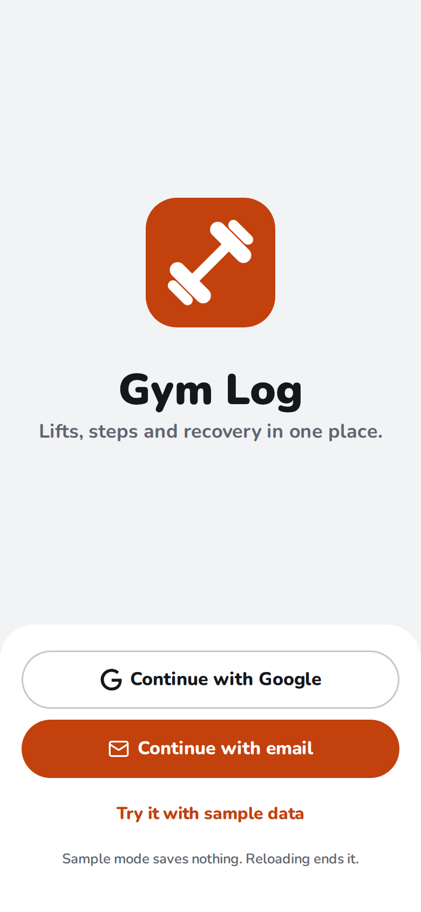
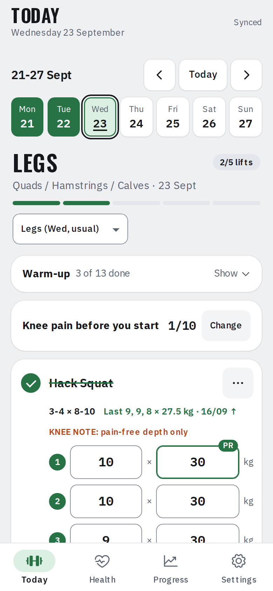
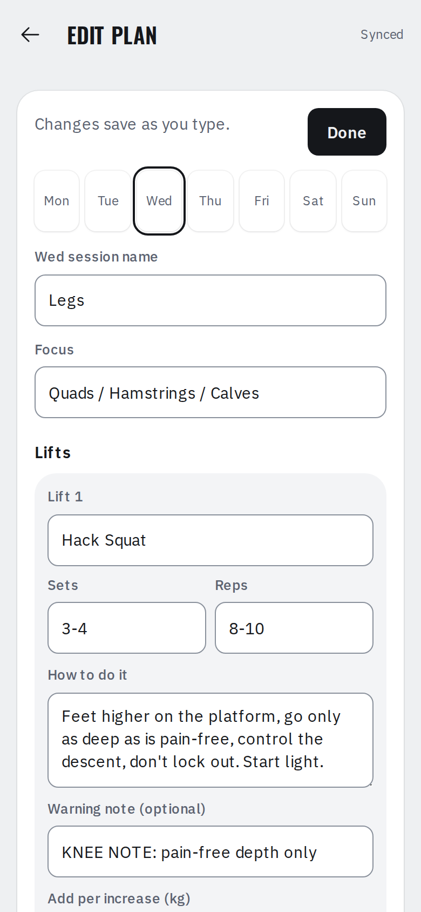

# User guide

Gym Log opens on today and works like a phone app: four tabs along the bottom, **Today**, **Health**, **Progress** and **Settings**. This page walks through each. For installing it, see the [README](../README.md#install-on-your-phone).

  
  
  

## Signing in

**Continue with Google**, or your email. With email, tap the link in the email **on the same phone**, or, once you've set a password (**Settings → Set a password**), tap **Use a password instead**. A Google account with the same email as an account made with an email link is the same account, with the same data.

## Today

- The app opens on today. Tap a day in the week strip to look at or fill in another day. A day is green when every lift is done, pale green with a green edge when some are, and has an orange edge when a workout day was missed.
- **Warm-up:** tap **Warm-up** to show the list and tick what you did. It starts folded so the lifts come first, and rest days don't show it.
- **Lifts and sets:** each lift is a card.
  - Under its name you see the plan (e.g. 3 × 8-10) and what you did last time, set by set. An arrow shows when today's heaviest set is already heavier.
  - Each planned set has a row: enter reps and kg, and the next set copies the weight you just used. Grey numbers in empty boxes are suggestions: last time's numbers, or the next weight to try.
  - A set's number turns green once its reps are logged, and logging the planned number of sets fills the round tick. Tap the tick to set it by hand.
  - **+ Set** adds a set and **− Set** removes the last one, asking first if it has numbers in it. **How to** opens the lift's form notes; warnings such as a KNEE NOTE always show.
  - The bar under the day's title fills as lifts are done.
- **Voice:** on the website and the installed web app, switch on **Settings → Log sets by voice**, then tap the microphone on a lift and say the set: *10 at 45*, *twelve reps at forty kilos*, *45 kg for 8* or *22.5 for 10*. *10 reps* on its own keeps the weight of the set before. Say *again* to repeat the last set, *undo* to clear it, *done* to tick the lift or *skip* to skip it for today. A line under the sets says what it heard; anything it can't read for certain, such as a weight in pounds, changes nothing. It uses the browser's speech recognition: in Chrome, what you say goes to Google to be turned into text. The Android app doesn't have it yet.
- **Change a day's workout:** the picker under the day's title lets any day use another day's workout, e.g. do a missed Push on a rest day. Rest days list the sessions you missed earlier that week, with a button to do one. The weekly count still counts each planned session once.
- **Skip or swap:** tap **···** on a lift. *Skip today* (with an optional reason, e.g. machine busy) or *Swap for another lift* to log a different exercise in its place. The same menu undoes either.
- **Adding weight:** when every set of a lift reached the top of its rep range last time, the lift says *Go up to … kg* and the grey numbers switch to the new weight at the bottom of the range. Each lift adds 2.5 kg unless you set its own step in the plan.
- **Records:** a set that beats every earlier session of that lift (heaviest weight, best estimated 1RM, or most reps at that weight or more) gets a **PR** badge as you type it.
- **Knee:** on days with knee-sensitive lifts, tap your knee pain from 0 to 10 before and after the session, and on waking the next morning. Once scored, the scale folds to one line; **Change** opens it again. If pain goes above your limit (5 unless you change it), or hasn't settled by the morning, knee-sensitive lifts say *Hold … kg* instead of going up next time.
- **Cardio and waist:** under the cardio finisher, log minutes, speed and incline (entering minutes ticks the finisher). The waist field sits next to body weight; once a week is enough.
- **Health Connect on Today:** in the [Android app](android.md), steps and body weight from Health Connect show in grey in their boxes until you type your own, and a card under them shows the night's sleep, resting heart rate, active calories and any workouts other apps recorded, with **More in Health** to open the Health tab at that day. The website shows the same numbers once the app has synced them.
- **Home-screen shortcuts:** once installed, long-press the app icon for *Today*, *Log weight* or *Log steps*.

## Health

The day's activity as three rings (steps, exercise minutes and active calories against your goals), then a tile for each kind of data: sleep with its stages, heart, calories burned and eaten, body (weight, body fat, BMI), water and exercise. ‹ › moves between days.

Tap a ring or a tile for its page: the day in detail (steps by the hour, the night's stages and times, heart rate range and vitals, workouts), or a week or a month as a chart with your goal and average, and the numbers that matter (average, days at the goal, average bedtime, change in weight). Tap a bar or a point, or use the arrow keys, to read its value.

The data comes from Health Connect through the [Android app](android.md). The website shows it too, once the app has synced it.

## Progress

Weight trend and weekly rate, with a goal date and your pace against the target once you set them in the plan; sessions kept, full weeks in a row and a calendar; steps by week; strength (estimated 1RM of each day's first lift, lifts ready for more weight, recent records); knee scores by session. Notes at the top point out anything that needs attention, such as no weigh-in for a while, short sleep, or a resting heart rate higher than last week.

### How the numbers work

- **Weight trend:** one value a day from your weigh-ins, with gaps filled by straight lines, smoothed with Holt's method as [TrendWeight](https://github.com/ervwalter/trendweight) does. It starts from a straight-line fit of your first two weeks, so it doesn't lag behind at the start.
- **Weekly rate:** a straight-line fit of your weigh-ins over the last four weeks. It shows once you have six weigh-ins spread over two weeks; before that, water weight hides the real change.
- **Estimated 1RM:** Brzycki's formula, only from sets of 12 reps or fewer.

## Settings

- **Edit plan:** change session names, lifts, sets/reps, cues, cardio, warm-ups, the step goal and tempo. Each lift can have its own weight step and be marked knee-sensitive; the plan also holds your goal weight, target loss a week (% of body weight) and knee pain limit. Changes save as you type and sync to your other devices. *Reset to the default plan* brings back the plan the app ships with.
- **Daily goals:** steps, sleep, exercise minutes, active calories, water. The Health tab's rings and charts use them.
- **Theme:** the phone's, or always light or dark.
- **Password:** sign in without waiting for an email. Once the account has a password, it offers **Change password** instead.
- **Export data** downloads every day as JSON; **Import data** brings a file like that back in. If the file has different entries for days you've already logged, it asks before replacing them.
- In the Android app, Settings also holds **Health Connect** and **Sync in the background**; see [Android app and Health Connect](android.md).

## Moving around

The tabs along the bottom switch screens; pages under a tab (a Health chart, the plan editor) have a back arrow. The phone's Back button walks back the way you came: a page to its tab, a tab to Today. Each screen has an address, so `/#progress`, `/#health/sleep` or `/#settings` open it directly.

## Saving and syncing

Changes save automatically. With poor gym signal they're kept on the phone and sync when you're back online. If a save fails, or you're offline with days waiting, a bar at the top says how many days haven't synced yet, with **Retry now**. The app asks the browser to keep its storage, so edits waiting to sync aren't cleared to free space.

The installed app loads its files from the phone's cache first, so it opens straight away even on weak signal. New versions download in the background and run from the next launch.

## Good to know

- Supabase's built-in email service sends only a few sign-in emails an hour for the whole project (about 2). If you hit the limit, the sign-in screen says so: wait an hour, or sign in with your password. The Send button also waits a minute after each link, since a new link replaces the last one.
- Your history follows each lift by name. Renaming a lift in the plan starts a fresh history for it; days you've already logged keep what you logged.
- Supabase's free plan pauses a project after about a week with no activity. Logging every day keeps it awake. If it does pause, click **Restore** in the Supabase dashboard; no data is lost.
